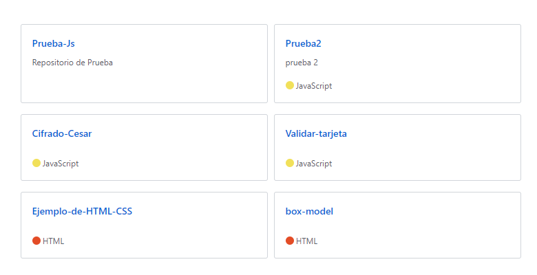

# Identifica los elementos de navegación en los siguientes sites:

## Breather

* Navegación global:

* Navegación local:

* Navegación facetada:

* Navegación contextual

* Navegación inline:

* Navegación suplementaria:

## Github

* Navegación global:

* Navegación local:

* Navegación facetada:

* Navegación filtrada

* Navegación contextual

* Navegación inline:

* Navegación suplementaria:

## Medium

* Navegación global:

* Navegación local:

* Navegación filtrada:

* Navegación contextual

* Navegación inline:

